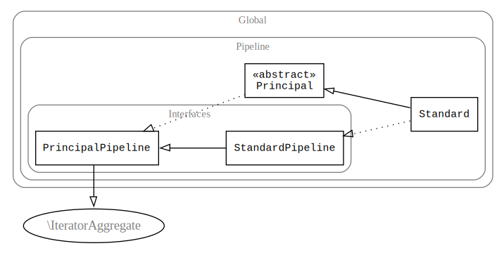

[](https://travis-ci.org/sanmai/pipeline)
[](https://coveralls.io/github/sanmai/pipeline?branch=master)
[](https://infection.github.io)
[](https://packagist.org/packages/sanmai/pipeline)

Pipeline makes creating do-it-yourself data pipelines easy by chaining generators. If you ever piped together several bash commands in succession, where one command uses output of another, this library does just that but for PHP functions and generators.

Pipeline comes with the most important yet basic building blocks. It boasts methods to map, filter, reduce, and unpack data from arbitrary generators and all kinds of standard iterators.

This rigorously tested library just works. Pipeline never throws any exceptions.

# Entry points

All entry points always return an instance of a standard pipeline.

|  Method     | Details                       |
| ----------- | ----------------------------- |
| `map()`     | Takes an optional initial callback, where it must not require any arguments. Other than that, works just like an instance method below. |
| `take()`  | Takes any Traversable, initializes a standard pipeline with it.  |
| `fromArray()`  | Takes an array, initializes a standard pipeline with it.  |

# Instance methods in a nutshell

|  Method     | Details                       | A.K.A.            |
| ----------- | ----------------------------- | ----------------- |
| `map()`     | Takes an optional callback that for each input value may return one or yield many. Also takes an initial generator, where it must not require any arguments. Provided no callback does nothing. Also available as a plain function. |  `array_map`, `Select`, `SelectMany`                  |
| `unpack()`  | Unpacks arrays into arguments for a callback. Flattens inputs if no callback provided. |  `flat_map`, `flatten`                 |
| `filter()`  | Removes elements unless a callback returns true. Removes falsey values if no callback provided.  |  `array_filter`, `Where`                |
| `reduce()`  | Reduces input values to a single value. Defaults to summation. | `array_reduce`, `Aggregate`, `Sum` |
| `toArray()` | Returns an array with all values. Eagerly executed. | `dict`, `ToDictionary` |
| `__construct()` | Can be provided with an optional initial iterator. Used in the `take()` function from above. Not part of any interface. |     |

Pipeline is an iterator and can be used as any other iterable. Implements `JsonSerializable`.

Pipeline is a final class. It comes with a pair of interfaces to aid you with [composition over inheritance](https://stackoverflow.com/questions/30683432/inheritance-over-composition).

# Install

    composer require sanmai/pipeline

# Use

```PHP
use function Pipeline\map;

// wrap an initial generator with a pipeline
$pipeline = map(function () {
    foreach (range(1, 3) as $i) {
        yield $i;
    }
});

// next processing step
$pipeline->map(function ($i) {
    yield pow($i, 2);
    yield pow($i, 3);
});

// simple one-to-one mapper
$pipeline->map(function ($i) {
    return $i - 1;
});

// one-to-many generator
$pipeline->map(function ($i) {
    yield [$i, 2];
    yield [$i, 4];
});

// mapper with arguments unpacked from an input array
$pipeline->unpack(function ($i, $j) {
    yield $i * $j;
});

// one way to filter
$pipeline->map(function ($i) {
    if ($i > 50) {
        yield $i;
    }
});

// this uses a filtering iterator from SPL under the hood
$pipeline->filter(function ($i) {
    return $i > 100;
});

// reduce to a single value; can be an array or any value
$value = $pipeline->reduce(function ($carry, $item) {
    // for the sake of convenience the default reducer from the simple pipeline does summation, just like we do here
    return $carry + $item;
}, 0);

var_dump($value);
// int(104)
```

# Caveats

- Since most callback are [lazily evaluated](https://en.wikipedia.org/wiki/Lazy_evaluation) as more data coming in and out, you must consume the results with a plain `foreach` or use a `reduce()` to make sure processing happens.

    ```php
    foreach ($pipeline as $result) {
        // Processing happens only if you consume the results.
        // Want to stop early after few results? Not a problem here!
    }
    ```

  Almost nothing will happen unless you use the results. That's the point of lazy evaluation after all!
  
- That said, if a non-generator used to seed the pipeline, it will be executed eagerly.

    ```php
    $pipeline = new \Pipeline\Standard();
    $pipeline->map(function () {
        // will be executed immediately on the spot, unless yield is used
        return $this->veryExpensiveMethod();
    })->filter();
    ```
  In the above case the pipeline will store an array internally, with which the pipeline will operate eagerly further along. *When in doubt, use a generator.*

- Keys for yielded values are being kept as is on a best effort basis, so one must take care when using `iterator_to_array()` on a pipeline: values with duplicate keys will be discarded with only the last value for a given key being returned. Safer would be to use provided `toArray()` method. It will return all values regardless of keys used, discarding all keys in the process.

- The resulting pipeline is an iterator and by default is not rewindable.

- Pipeline implements `IteratorAggregate` which is not the same as `Iterator`. Where the latter needed, the pipeline can be wrapped with an `IteratorIterator`:

    ```php
    $iterator = new \IteratorIterator($pipeline);
    /** @var $iterator \Iterator */
    ```

# Classes and interfaces: overview

- `\Pipeline\Standard` is the main user-facing class for the pipeline with sane defaults for most methods.
- `\Pipeline\Principal` is an abstract class you may want to extend if you're not satisfied with defaults from the class above. E.g. `getIterator()` can have different error handling.
- Interface `PrincipalPipeline` defines three main functions all pipelines must bear.
- Interface `StandardPipeline` defines `unpack()` from the standard pipeline.

This library is built to last. There's not a single place where an exception is thrown. Never mind any asserts whatsoever.

## Class inheritance diagram

- `\Pipeline\Standard` extends `\Pipeline\Principal` and implements `StandardPipeline`.
- Abstract `\Pipeline\Principal` implements `PrincipalPipeline`.
- Interface `PrincipalPipeline` extends `StandardPipeline`.
- Interface `PrincipalPipeline` extends `\IteratorAggregate`.



# Methods

## `__construct()`

Takes an insance of `Traversable` or none. In the latter case the pipeline must be primed by passing an initial generator to the `map` method.

## `map()`

Takes a processing stage in a form of a generator function or a plain mapping function. Provided no callback does nothing.

```php
$pipeline->map(function (Customer $customer) {
    foreach ($customer->allPayments() as $item) {
        yield $item;
    }
});
```

Can also take an initial generator, where it must not require any arguments.

```php
$pipeline = new \Pipeline\Standard();
$pipeline->map(function () {
    yield $this->foo;
    yield $this->bar;
});
```

## `unpack()`

An extra variant of `map` which unpacks arrays into arguments for a callback.

Where with `map()` you would use:

```php
$pipeline->map(function ($args) {
    list ($a, $b) = $args;

    // and so on
});
```

With `unpack()` these things are done behind the scene for you:

```php
$pipeline->map(function () {
    yield [-1, [10, 20], new DateTime()];
});
$pipeline->unpack(function ($a, array $b, \DateTime ...$dates) {
    // and so on
});
```

You can have all kinds of standard type checks with ease too.

With no callback, the default callback for `unpack()` will flatten inputs:

```php
$pipeline->map(function () {
    yield [1];
    yield [2, 3];
})->unpack()->toArray();
// [1, 2, 3]
```

## `filter()`

Takes a filter callback not unlike that of `array_filter`.

```php
$pipeline->filter(function ($item) {
    return $item->isGood() && $item->amount > 0;
});
```

Standard pipeline has a default callback with the same effect as in `array_filter`: it'll remove all falsy values.

## `reduce()`

Takes a reducing callback not unlike that of `array_reduce` with two arguments for the value of the previous iteration and for the current item.
As a second argument it can take an inital value.

```php
$total = $pipeline->reduce(function ($curry, $item) {
    return $curry + $item->amount;
}, 0);
```

Standard pipeline has a default callback that sums all values.

## `toArray()`

Returns an array with all values from a pipeline. All array keys are ignored to make sure every single value is returned.

```php
// Yields [0 => 1, 1 => 2]
$pipeline = map(function () {
    yield 1;
    yield 2;
});

// For each value yields [0 => $i + 1, 1 => $i + 2]
$pipeline->map(function ($i) {
    yield $i + 1;
    yield $i + 2;
});

$result = $pipeline->toArray();
// Since keys are ignored we get:
// [2, 3, 3, 4]
```

If in the example about one would use `iterator_to_array($result)` they would get just `[3, 4]`.

## `getIterator()`

A method to conform to the `Traversable` interface. In case of unprimed `\Pipeline\Standard` it'll return an empty array iterator, essentially a no-op pipeline. Therefore this should work without errors:

```php
$pipeline = new \Pipeline\Standard();
foreach ($pipeline as $value) {
    // no errors here
}
```

This allows to skip type checks for return values if one has no results to return: instead of `false` or `null` it is safe to return an unprimed pipeline.

## `__invoke()`

Returns a generator with all values currently in the pipeline. Allows to connect pipelines freely.

```php
$foo = new \Pipeline\Standard();
$foo->map(function () {
    yield 1;
    yield 2;
});

$bar = new \Pipeline\Standard();
$bar->map($foo);
$this->assertEquals(3, $bar->reduce());
var_dump($bar->reduce());
// int(3)
```


# Contributions

Contributions to documentation and test cases are welcome. Bug reports are welcome too. 

API is expected to stay as simple as it is, though.

# Use case

Imagine you have a very deep and complex processing chain. Something akin to this obviously contrived example:

```php
foreach ($obj->generator() as $val) {
    if ($val->a || $val->foo() == 3) {
        foreach ($val->bar as $b) {
            if ($b->keys) {
                foreach ($b->keys as $key) {
                    if ($key->name == "foo") {
                        foreach ($b->assoc[$key->id] as $foo) {
                            // ...
                        }
                           foreach ($b->uassoc[$key->id] as $foo) {
                               // ...
                           }
                    }
                }
            }
        }
    }
}
```

Now, you naturally want to break this monster down into manageable parts. You think you could do it like this:

```php
$step1 = [];
foreach ($obj->generator() as $val) {
    if ($val->a || $val->foo() == 3) {
        $step1[] = $val->bar;
    }
}

$step2 = [];
foreach ($step1 as $b) {
    if ($b->keys) {
        $step2[] = $b->keys;
    }
}

$step3 = [];
foreach ($step2 as $key) {
    if ($key->name == "foo") {
        $step3[] = $b->assoc[$key->id];
        $step3[] = $b->uassoc[$key->id];
    }
}

$step4 = [];
foreach ($step3 as $foo) {
    // ...
}
```

Indeed you made it somewhat simpler to understand, but this is still far from perfect. Three things come to mind:

1. You lost type information here and there, so no autocomplete suggestions for you.
2. On every step, every result has to buffer. This not only takes memory space, but you would not see if your algorithm is failing on the last step until you passed all the previous steps. What a bummer!
3. These separate cycles are nice, but you still can not test them one by one. That's practically impossible without further work.

One may think they can pull the trick with `array_map`. But there's a catch: you can't easily return more than one value from `array_map`. No luck here too.

So, how do you solve this problem? Pipeline to the rescue!

## Pipeline

With the pipeline, you could split just about any processing chain into a manageable sequence of testable generators or mapping functions. Want to know average shipping delay for these three warehouses for orders made during previous sale? Map matching orders into shipments, exclude unwanted warehouses, map shipments into dates and timings, sum and divide. Done!

Take a single step and write a generator or a function for it:

```php
$this->double = function ($value) {
    return $value * 2;
};

$this->rowTotal = function (SomeType $value) {
    yield $value->price * $value->quantity;
};
```

With type checks and magic of autocomplete! Apply it to the data:

```php
$sourceData = new \ArrayIterator(range(1, 1000)); // can be any type of generator

$pipeline = new \Pipeline\Standard($sourceData);
$pipeline->map($this->double);
// any number of times in any sequence
$pipeline->map($this->double);
```

Get results for the first rows immediately.

```php
foreach ($pipeline as $result) {
    echo "$result,";
}
// immediately starts printing 4,8,12,...
```

Test with ease:

```php
$this->plusone = function ($value) {
    yield $value;
    yield $value + 1;
};

$this->assertSame([4, 5], iterator_to_array(call_user_func($this->plusone, 4)));
```

Pretty neat, eh?

You can even pass on an instance of [League\Pipeline](https://github.com/thephpleague/pipeline) to batch-process a collection of values, not just a single value it can usually handle:

```php
$leaguePipeline = (new \League\Pipeline\Pipeline())->pipe(function ($payload) {
    return $payload + 1;
})->pipe(function ($payload) {
    return $payload * 2;
});

$pipeline = new \Pipeline\Standard(new \ArrayIterator([10, 20, 30]));
$pipeline->map($leaguePipeline);

foreach ($pipeline as $result) {
    echo "$result,";
}
// prints 22,42,62,
```


# About collection pipelines in general

[About pipelines in general](https://martinfowler.com/articles/collection-pipeline/) from Martin Fowler.

What else is out there:

- [Pipe operator from Hack](https://docs.hhvm.com/hack/operators/pipe-operator) is about same, only won't work for generators, and not under the regular PHP. [See a proposal for a similar operator for JavaScript.](https://github.com/tc39/proposal-pipeline-operator)

- [League\Pipeline](https://github.com/thephpleague/pipeline) is good for single values only. Similar name, but very different purpose. Not supposed to work with sequences of values. Each stage may return only one value.

- [Knapsack](https://github.com/DusanKasan/Knapsack) is a close call. Can take a Traversable as an input, has lazy evaluation. But can't have multiple values produced from a single input. Has lots of utility functions for those who need them: they're out of scope for this project.

- [transducers.php](https://github.com/mtdowling/transducers.php) is worth a close look if you're already familiar transducers from Clojure. API is not very PHP-esque. Read as not super friendly. [Detailed write-up from the author.](http://mtdowling.com/blog/2014/12/04/transducers-php/)

- [Functional PHP](https://github.com/lstrojny/functional-php) is supposed to complement currently exisiting PHP functions, which it does, although it is subject to some of the same shortcomings as are `array_map` and `array_filter`. No method chaining. 

- [Chain](https://github.com/cocur/chain) provides a consistent and chainable way to work with arrays in PHP, although for arrays only. No lazy evaluation. 

- Submit a PR to add yours.

# More badges

[](https://www.codacy.com/app/sanmai/pipeline?utm_source=github.com&utm_medium=referral&utm_content=sanmai/pipeline&utm_campaign=badger)
[](https://codeclimate.com/github/sanmai/pipeline/maintainability)
[](https://packagist.org/packages/sanmai/pipeline)

